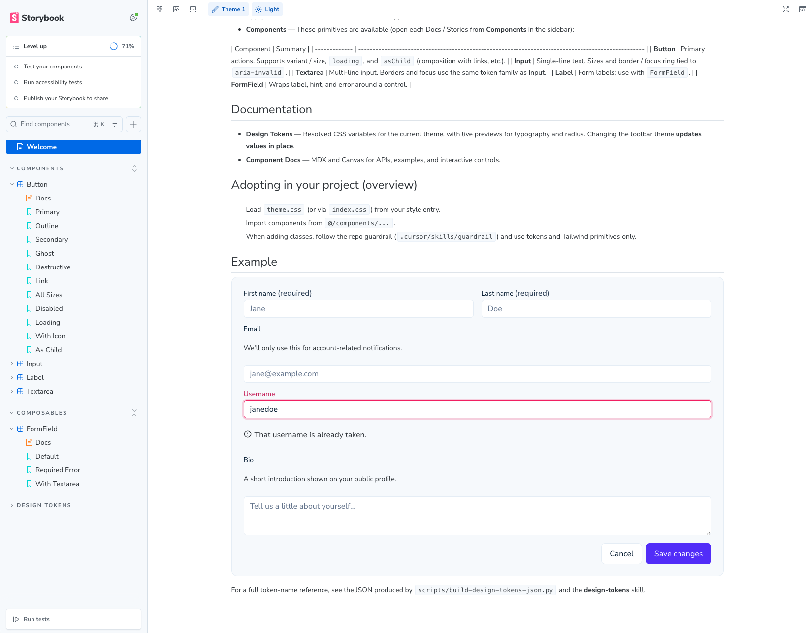

# Alpha Design System




**Alpha Design System** is a React component library and token layer for building accessible product UI. It ships with [Storybook](https://alpha-design-system-five.vercel.app/?path=/docs/getting-started-overview--docs) as the single place to browse components, read MDX documentation, and watch **design tokens** update live when you switch theme or light/dark mode in the toolbar.

If you landed here from GitHub, the fastest way to understand the system is to run Storybook locally: you get interactive controls, accessibility checks, and docs pages (including **Getting Started → Overview** and token galleries) without wiring anything into an app first.

After `npm install` / `pnpm install`, Git uses `.githooks` via `core.hooksPath` (see the `prepare` script in `package.json`). Commits whose first line starts with `feature:` trigger a `post-commit` update to `src/docs/changelog.mdx`.

## Why open Storybook?

- **See components in isolation** — Button, Input, Textarea, Label, and FormField with variants, sizes, loading states, and composition patterns (`asChild`, form layouts).
- **Token-driven visuals** — Colors, typography, and radius resolve from CSS variables; switch **Theme** and **Mode** in the Storybook toolbar to compare Theme 1 / Theme 2 and light / dark without touching code.
- **Documentation in one surface** — MDX pages explain adoption, token usage, and guardrails next to live Canvas examples.

```bash
npm install
npm run storybook
```

Then open **http://localhost:6006** (default port). Start from **Getting Started → Overview** in the sidebar, then explore **Components** and **Design Tokens**.

## Overview

| Area | What it is |
| --- | --- |
| **Stack** | React 19, TypeScript, Vite 8, Tailwind CSS 4, Radix primitives, CVA, Storybook 10 |
| **Styling** | Semantic tokens in `src/styles/theme.css` and Tailwind `@theme` — prefer tokens over ad-hoc colors and `dark:` sprawl |
| **Accessibility** | Radix-based patterns, Storybook a11y addon, and components wired for labels, hints, and invalid states |
| **Testing** | Vitest with the Storybook project (`npm run test:storybook`) |

Components live under `src/components/`. Docs and token showcases live under `src/docs/`.

## Distribution (npm and shadcn registry)

This repo ships the same components in two ways.

### npm package

Peers: `react`, `react-dom`, and Tailwind CSS v4.

```bash
pnpm add alpha-design-system
```

Import tokens in your app CSS entry (example):

```css
@import "tailwindcss";
@source "../node_modules/alpha-design-system/dist/**/*.js";

@import "alpha-design-system/styles.css";
```

Use a `@source` path **relative to the CSS file** so Tailwind v4 scans class names in the package’s built `dist/**/*.js` (e.g. `../../node_modules/...` from `src/app/globals.css`). See Storybook **Getting Started → Installation** for a short path table.

Usage:

```tsx
// Prefer subpath imports so the bundler only resolves what you use:
import { Button } from "alpha-design-system/button";

// Barrel import (root) re-exports every public component; avoid it unless you need many at once.
import { Button } from "alpha-design-system";
```

Subpaths follow `package.json` `exports` (e.g. `alpha-design-system/drawer`, `alpha-design-system/chart`).

### shadcn registry (copy files into a project)

After deploy (e.g. Vercel), registry files are served at `/r/<name>.json`. Merging to `main` rebuilds them.

```bash
npx shadcn@latest add https://alpha-design-system-five.vercel.app/r/button.json
```

Components that use `cn` depend on the `utils` registry item via `registryDependencies`.

## Adding a component

1. Add `src/components/<name>/<name>.tsx` and `index.ts` (same layout as existing folders).
2. Run `pnpm run build:lib` or `node scripts/build-registry.mjs` to refresh `registry.json`, `package.json` exports, and `src/index.ts` from the filesystem.
3. If the change should ship on npm, include a Changeset: `pnpm changeset` and commit `.changeset/*.md` in your PR.

## Releases (Changesets + GitHub Actions)

- After merges to `main`, a **Version Packages** PR is opened or updated; merging it runs `npm publish` and creates a GitHub Release.
- Manual: GitHub **Actions → Release → Run workflow**, or locally `pnpm release` after versions are bumped.

Add an **`NPM_TOKEN`** secret (npm automation token) to the repository.

## Scripts

| Command | Description |
| --- | --- |
| `pnpm run dev` | Vite dev server for the app shell |
| `pnpm run storybook` | Storybook dev server on port **6006** |
| `pnpm run build-storybook` | Static Storybook build |
| `pnpm run test:storybook` | Vitest (Storybook project) |
| `pnpm run build:lib` | Registry sync + library build to `dist/` |
| `pnpm run registry:build` | Registry sync + `shadcn build` → `public/r/*.json` |
| `pnpm run build` | `build:lib` + `registry:build` + `build-storybook` |
| `pnpm run build:app` | App shell: `tsc -b` + `vite build` |
| `pnpm run lint` | ESLint |
| `pnpm run typecheck` | `tsc -b` |

## Adopting in your own project (short version)

1. Load the theme stylesheet (e.g. import `alpha-design-system/styles.css` or copy `src/styles/theme.css` from this repo).
2. Import components from the npm package or via shadcn add URLs (see above).
3. Mirror `data-theme` / `.dark` on the document root if you want the same theme switching as Storybook.

For token naming and conventions, the design-token reference used in this workspace is documented in-repo (see `src/docs/` and related scripts under `scripts/`).

## License

Published npm package and source are under the [MIT License](LICENSE) unless noted otherwise in specific files.

---

_Built with Vite + React + TypeScript. ESLint is configured for type-aware rules where applicable; extend `eslint.config.js` as your product grows._
